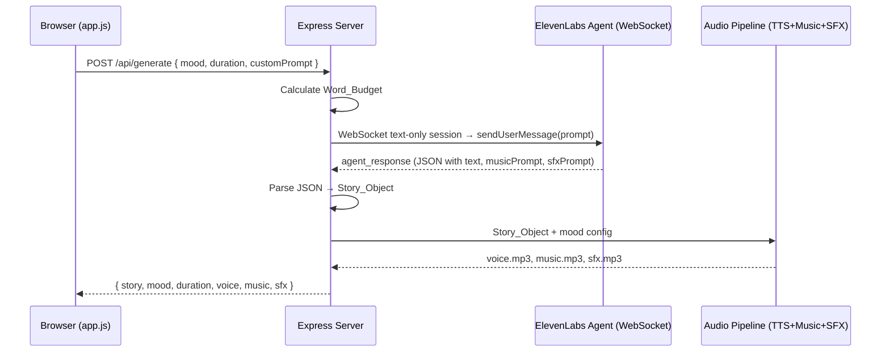
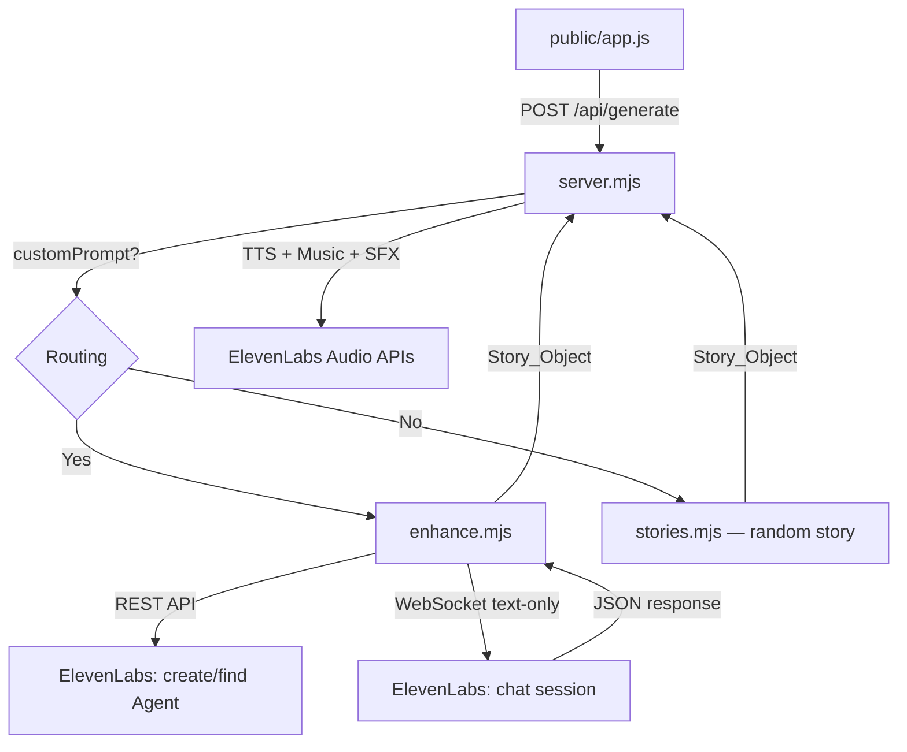
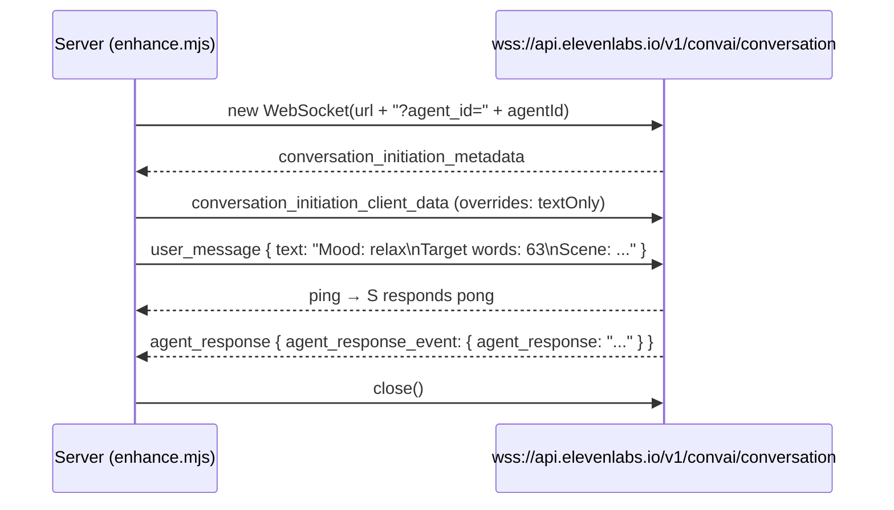

# Design Document: Custom Prompt Enhance

## Overview

This feature adds a "Custom Prompt" mode to MoodCast, where the user enters a short text prompt and the system expands it into a full Story_Object (story text + music and SFX prompts) via an ElevenLabs Conversational AI Agent in text-only mode. The result is passed to the existing Audio Pipeline without changes.

Key architectural decision: we use an ElevenLabs Conversational AI Agent as the LLM provider. The agent is created once via REST API, and each enhancement request is a separate WebSocket text-only session. This keeps everything within the ElevenLabs ecosystem without external LLM dependencies.

### Data Flow



## Architecture

### Component Overview



### Decisions and Rationale

1. **Separate `enhance.mjs` module** — all enhancement logic is isolated from server.mjs. Minimal changes to existing code.

2. **Raw WebSocket instead of `@elevenlabs/client`** — the `@elevenlabs/client` package is designed for browsers (AudioContext, getUserMedia). On the server (Node.js 22) we use native `WebSocket` to connect to `wss://api.elevenlabs.io/v1/convai/conversation`.

3. **Agent created once on first request (lazy init)** — the agent is not created at server startup. On the first custom request, we call the REST API to create the agent and cache the `agentId` in memory. On server restart — create a new one (hackathon approach, no persistent storage).

4. **One WebSocket session per request** — open connection, send message, collect response, close. Simple model without connection pooling.

5. **Best-effort approach to Word_Budget** — we ask the LLM to generate the target word count but don't re-request on deviation. Acceptable for a hackathon.

## Components and Interfaces

### 1. `enhance.mjs` — Enhancement Module

```javascript
// Public API
export async function enhancePrompt(userPrompt, mood, duration) → Story_Object
// { text: string, musicPrompt: string, sfxPrompt: string }
```

Internal functions:
- `ensureAgent()` — creates or returns cached agentId
- `chatWithAgent(agentId, message)` — opens WebSocket session, sends message, returns text response
- `parseAgentResponse(rawText)` — parses JSON from agent response
- `calculateWordBudget(mood, duration)` — calculates target word count

### 2. Changes to `server.mjs`

Minimal changes to the `/api/generate` endpoint:

```javascript
// Add import
import { enhancePrompt } from "./enhance.mjs";

// In POST /api/generate handler:
// If customPrompt exists — call enhancePrompt() instead of pick(storyPool)
```

### 3. Changes to `public/app.js`

- Add Mode_Selector (toggle "Random Story" / "Custom Prompt")
- Add Prompt_Input with validation and character counter
- Pass `customPrompt` in POST request
- Add "Enhancing your prompt" step on loading screen

### 4. Changes to `public/index.html`

- Add Mode_Selector and Prompt_Input UI elements to the mood-select section
- Add enhance step to the loading section

## Data Models

### Story_Object (existing format)

```javascript
{
  text: string,        // Story text for TTS
  musicPrompt: string, // Prompt for ElevenLabs Music API
  sfxPrompt: string    // Prompt for ElevenLabs SFX API
}
```

### Word_Budget — Target Values Table

| Mood    | Speed | Short (17s) | Medium (32s) | Long (52s) |
|---------|-------|-------------|--------------|------------|
| relax   | 0.85  | ~34 words   | ~63 words    | ~103 words |
| focus   | 0.95  | ~38 words   | ~71 words    | ~115 words |
| energy  | 1.1   | ~44 words   | ~82 words    | ~133 words |
| sleep   | 0.75  | ~30 words   | ~56 words    | ~91 words  |

Formula: `targetWords = Math.round((targetDurationSec × 140 × speed) / 60)`

### Agent Configuration

```javascript
{
  name: "MoodCast Story Enhancer",
  conversationConfig: {
    agent: {
      firstMessage: "",
      language: "en",
      prompt: {
        prompt: SYSTEM_PROMPT, // Instruction for JSON generation
        llm: "gemini-2.0-flash",
        temperature: 0.7
      }
    },
    conversation: {
      textOnly: true,
      maxDurationSeconds: 30
    }
  }
}
```

### Agent System Prompt (SYSTEM_PROMPT)

```
You are a creative story writer for an audio experience app called MoodCast.

The user will send you a message with:
- A short scene description (their prompt)
- A target mood (relax, focus, energy, or sleep)
- A target word count for the story text

You MUST respond with ONLY a valid JSON object (no markdown, no explanation) with exactly these fields:
- "text": the story text matching the mood and approximately the target word count
- "musicPrompt": a prompt for AI music generation that matches the story mood (describe instruments, tempo, atmosphere)
- "sfxPrompt": a prompt for AI sound effects that match the story scene (describe ambient sounds, environment)

The story should be immersive, second-person ("you"), present tense, and match the mood:
- relax: calm, gentle, soothing imagery
- focus: clarity, determination, flow state
- energy: power, excitement, motivation
- sleep: dreamy, soft, lullaby-like

Keep musicPrompt under 100 words. Keep sfxPrompt under 50 words.
```

### Agent Message Format

```
Mood: {mood}
Target words: {wordBudget}
Scene: {userPrompt}
```

### WebSocket Protocol (text-only session)



### API Request (extended)

```javascript
// POST /api/generate
{
  mood: "relax",           // required
  duration: "medium",      // required
  customPrompt: "a walk through rainy Tokyo at night"  // optional
}
```

### API Response (unchanged)

```javascript
{
  story: "...",
  mood: "Relax",
  duration: "Medium",
  voice: "/audio/voice-abc123.mp3",
  music: "/audio/music-abc123.mp3",
  sfx: "/audio/sfx-abc123.mp3"
}
```

## Correctness Properties

### Property 1: Prompt Length Validation

*For any* string of arbitrary length, the prompt validation function SHALL accept strings between 3 and 200 characters (inclusive) and reject all others. Strings consisting only of whitespace with fewer than 3 non-whitespace characters SHALL also be rejected.

**Validates: Requirements 2.1, 2.3, 2.4**

### Property 2: Character Counter Correctness

*For any* string of length 0 to 300 characters, the remaining character counter SHALL show the value `max(0, 200 - length)`, where length is the current string length.

**Validates: Requirements 2.5**

### Property 3: Word Budget Calculation

*For any* valid combination of mood (relax, focus, energy, sleep) and duration (short, medium, long), the `calculateWordBudget` function SHALL return a value equal to `Math.round((targetDurationSec × 140 × speed) / 60)`, where speed is taken from the MOODS configuration and targetDurationSec from the duration table (short=17, medium=32, long=52).

**Validates: Requirements 3.1, 3.2, 3.3**

### Property 4: Agent Message Completeness

*For any* valid prompt, mood, and word budget, the formatted message for the agent SHALL contain all three components: the user's prompt text, the mood name, and the numeric word budget value.

**Validates: Requirements 5.2**

### Property 5: Story_Object Round-Trip Parsing

*For any* valid Story_Object (object with non-empty string fields text, musicPrompt, sfxPrompt), serialization to JSON via `JSON.stringify` followed by parsing via `parseAgentResponse` SHALL produce an equivalent object.

**Validates: Requirements 9.2, 9.5**

### Property 6: JSON Extraction from Wrapped Text

*For any* valid Story_Object, if its JSON representation is wrapped with arbitrary text (prefix and/or suffix without `{` and `}` characters), the `parseAgentResponse` function SHALL successfully extract and parse the JSON, returning an equivalent object.

**Validates: Requirements 9.3**

## Error Handling

| Scenario | Handling | HTTP Code |
|----------|----------|-----------|
| `customPrompt` shorter than 3 characters | Client-side validation, request not sent | — |
| ElevenLabs Agent API unavailable | `enhancePrompt` throws error → server returns 500 | 500 |
| WebSocket session fails to open | 15-second timeout → error "Agent connection timeout" | 500 |
| WebSocket session closes without response | Error "Agent session closed without response" | 500 |
| Agent response is invalid JSON | Attempt to extract `{...}` from text. If failed — error "Failed to parse AI response" | 500 |
| Agent response is JSON without required fields | Error "Failed to parse AI response" | 500 |
| Error in Audio Pipeline (TTS/Music/SFX) | Existing error handling in server.mjs | 500 |

All errors are returned to the client in the format `{ error: string, details: string }`. The client shows the message and returns the user to the selection screen.

## Testing Strategy

### Approach

Dual testing approach:
- **Property-based tests** — verify universal properties across many generated inputs
- **Unit tests** — verify specific examples, edge cases, and integration points

### Property-Based Tests

Library: **fast-check** (JavaScript PBT library)

Configuration: minimum 100 iterations per property test.

Each test is tagged: **Feature: custom-prompt-enhance, Property {N}: {description}**

Properties tested:
1. Prompt length validation (Property 1)
2. Character counter correctness (Property 2)
3. Word Budget calculation (Property 3)
4. Agent message completeness (Property 4)
5. Story_Object round-trip parsing (Property 5)
6. JSON extraction from wrapped text (Property 6)

### Unit Tests

- Routing in `/api/generate`: with `customPrompt` → enhance path, without → random path
- agentId caching: repeated `ensureAgent()` call does not create a new agent
- Error handling: WebSocket timeout, invalid response, missing fields
- UI: default "Random Story" mode, mode switching, enhance step display

### What is NOT Tested with Property-Based Tests

- Agent creation via ElevenLabs API (integration)
- WebSocket session with real agent (integration)
- Quality of generated stories (subjective)
- UI rendering and visual effects
